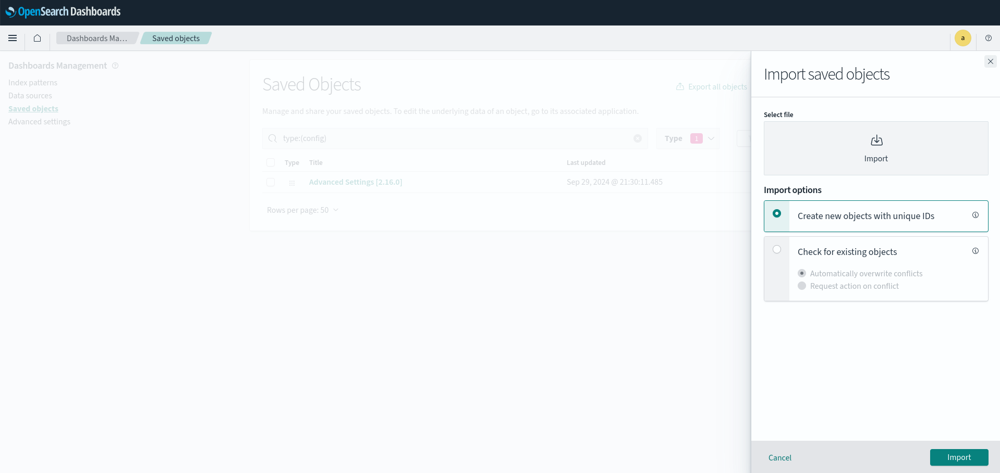
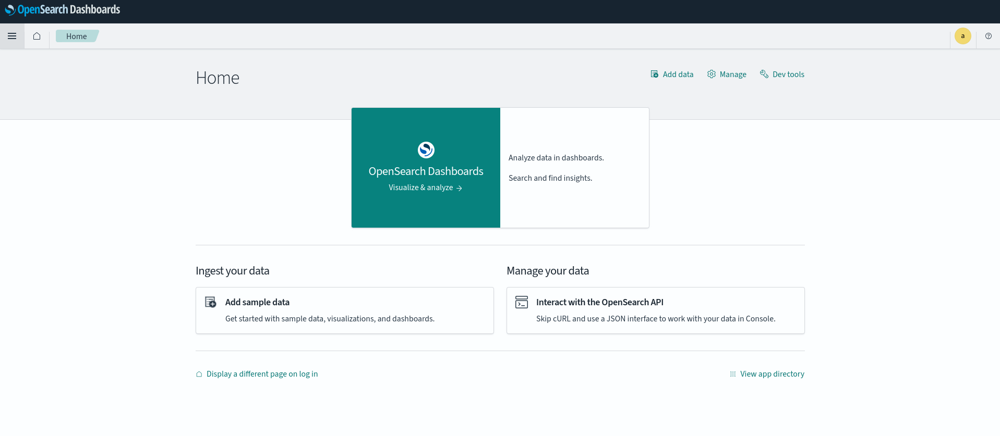
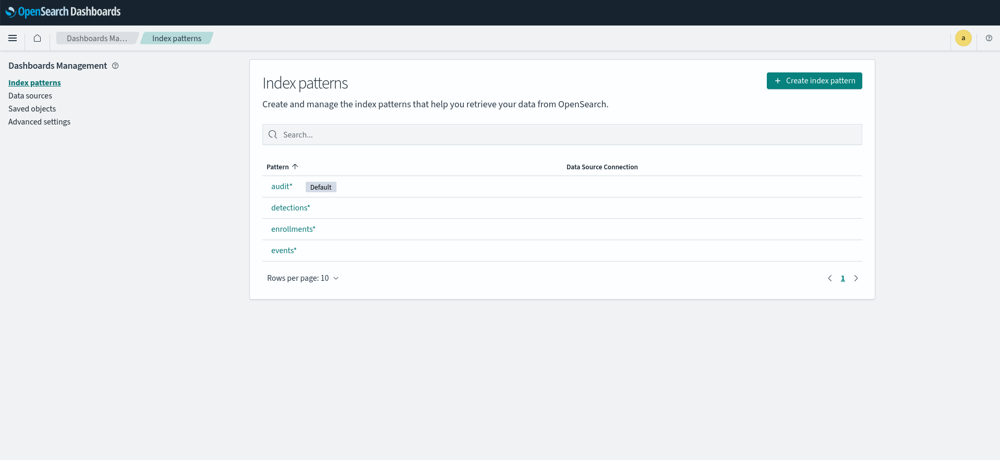
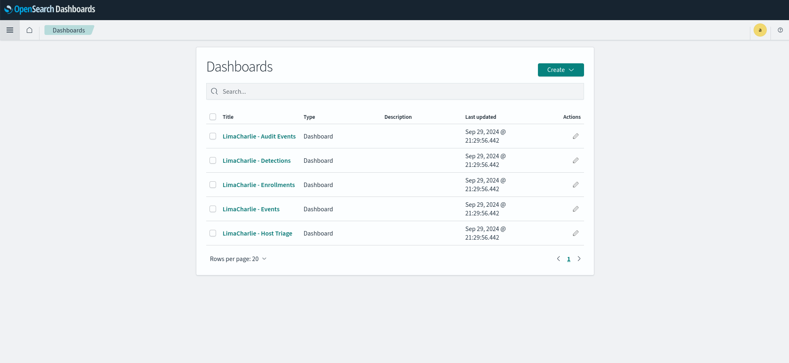

# LimaCharlie OpenSearch Dashboards 

If you are (or plan to be) shipping data from LimaCharlie to [OpenSearch](https://opensearch.org), this repo provides dashboards that may be useful for visualizing your LimaCharlie telemetry. 

We've provided sample dashboards for viewing events, detections, audit events, and sensor enrollments, as well a host triage dashboard that gives data points of interest for one or more sensors in a query.

## How to Use

You can either deploy OpenSearch with the provided `docker-compose.yaml` if you do not have an existing cluster, or you can just import the [LimaCharlie infrastructure as code](https://docs.limacharlie.io/docs/extensions-lc-extensions-infrastructure#using-the-infrastructure-extension) to send data to a preexisting OpenSearch cluster. 

* Adjust passwords in `docker-compose.yaml` and in the docker commands below
* Adjust protocols (http or https), IPs (or URLs), ports, usernames, and passwords in `outputs.yaml` before applying to your LimaCharlie org
* Add `opensearch-node2` back to the `docker-compose.yml` if you want to deploy multiple OpenSearch nodes

> [!CAUTION]
> This is not intended to be used as a production deployment. If you are deploying OpenSearch in production, ensure that you are taking proper security precautions and using best practices, such as SSL certificates, usernames and passwords, tenancy and permissions considerations, etc. More details regarding the secure deployment of OpenSearch can be found [here](https://opensearch.org/docs/latest/security/configuration/index/).

> [!IMPORTANT]
> Passwords must be at least 8 characters, contain at least one uppercase letter [A–Z], contain at least one lowercase letter [a–z], contain at least one digit [0–9], and contain at least one special character. More information [here](https://opensearch.org/docs/latest/security/configuration/demo-configuration/#setting-up-a-custom-admin-password).

> [!NOTE]
> The amount of data you will be able to ingest and search effectively completely depends upon the size of your cluster, how much CPU/memory/storage you allocate to your OpenSearch deployment, and what kind of data you're ingesting. This is not a one size fits all scenario. More information regarding best practices for resources and sizing can be found [here](https://docs.aws.amazon.com/opensearch-service/latest/developerguide/bp.html).

## Deployment Options
### Option 1 - Deploy New OpenSearch Cluster 

#### Deploy 

Run the following `docker-compose` command, and wait for all containers to be ready before performing the imports below. OpenSearch Dashboards will be available on http://localhost:5601.

```bash
docker-compose up -d 
```
To watch the logs for your containers, you can run the following:
```bash
docker logs -f opensearch-node1
docker logs -f opensearch-dashboards
```

#### Import 

**Index Templates:** 
In order to see the accurate data in OpenSearch, we need to make sure the field mappings for the data coming in are appropriate. This is applied in the index templates. 


```bash
docker exec opensearch-node1 bash -c "curl -k -XPUT https://localhost:9200/_index_template/events -u admin:'password' -H 'Content-Type: application/json' -d '{\"index_patterns\": [\"events*\"], \"template\": {\"settings\": {\"index.mapping.total_fields.limit\": 10000, \"index.refresh_interval\": \"5s\", \"index.number_of_shards\": 1, \"index.number_of_replicas\": 0}, \"mappings\": {\"properties\": {\"routing\": {\"type\": \"object\", \"properties\": {\"event_time\": {\"type\": \"date\"}}}, \"event\": {\"type\": \"object\", \"properties\": {\"MODIFICATION_TIME\": {\"type\": \"date\"}, \"LAST_UPDATE\": {\"type\": \"text\"}, \"CREATION_TIME\": {\"type\": \"date\"}, \"ACCESS_TIME\": {\"type\": \"date\"}, \"THREADS\": {\"enabled\": false, \"type\": \"object\"}, \"RULE_NAME\": {\"type\": \"text\"}, \"TIMEDELTA\": {\"type\": \"unsigned_long\"}, \"EVENT\": {\"type\": \"object\", \"properties\": {\"System\": {\"type\": \"object\", \"properties\": {\"Correlation\": {\"enabled\": false, \"type\": \"object\"}, \"Security\": {\"enabled\": false, \"type\": \"object\"}}}, \"EventData\": {\"type\": \"object\", \"properties\": {\"Data\": {\"enabled\": false, \"type\": \"object\"}}}}}}}}}}, \"composed_of\": [], \"priority\": 10, \"_meta\": {\"flow\": \"simple\"}}'"

docker exec opensearch-node1 bash -c "curl -k -XPUT https://localhost:9200/_index_template/detections -u admin:'password' -H 'Content-Type: application/json' -d '{\"index_patterns\":[\"detections*\"],\"template\":{\"settings\":{\"index.mapping.total_fields.limit\":\"10000\",\"index.refresh_interval\":\"5s\",\"index.number_of_shards\":\"1\",\"index.number_of_replicas\":\"0\"},\"mappings\":{\"properties\":{\"routing\":{\"type\":\"object\",\"properties\":{\"event_time\":{\"type\":\"date\"}}},\"detect\":{\"type\":\"object\",\"properties\":{\"event\":{\"type\":\"object\",\"properties\":{\"EVENT\":{\"type\":\"object\",\"properties\":{\"System\":{\"type\":\"object\",\"properties\":{\"Correlation\":{\"enabled\":false,\"type\":\"object\"}}}}}}}}}}},\"aliases\":{}},\"composed_of\":[],\"priority\":\"10\",\"_meta\":{\"flow\":\"simple\"}}'"
```

**Dashboards and Visualizations:**

5 dashboards will be imported, along with all of the associated visualizations and index patterns for each.


```bash
docker exec opensearch-dashboards bash -c 'curl -k -X POST "http://localhost:5601/api/saved_objects/_import?overwrite=true" -u admin:"password" -H "osd-xsrf: true" --form file=@/opt/exports/export.ndjson'
```

### Option 2 - Import Into Existing OpenSearch Cluster
You can easily export the provided `export.ndjson` into your existing OpenSearch cluster via the GUI.



## LimaCharlie Outputs

In order to ship data from LimaCharlie to OpenSearch, you need to configure outputs pointed at your cluster. We've provided an `outputs.yaml` for you. Again, you will need to modify this before importing with your specific username/password/IP/port  values.

You can import this a couple of ways:

* Via infrastructure as code in the LimaCharlie web app
* Via the SDK / command line tools - https://docs.limacharlie.io/docs/platform-configuration-limacharlie-sdk
    ```bash
    limacharlie configs push --oid $YOUR_OID --config outputs.yaml --outputs --use-infra-extension
    ```

## End Result
Once you have either deployed your cluster and run the import, or simply run the import within your existing cluster, you should see some variation of the following:





Once you start shipping data to your cluster from your LimaCharlie outputs, the dashboards in the last screenshot should start populating with data.